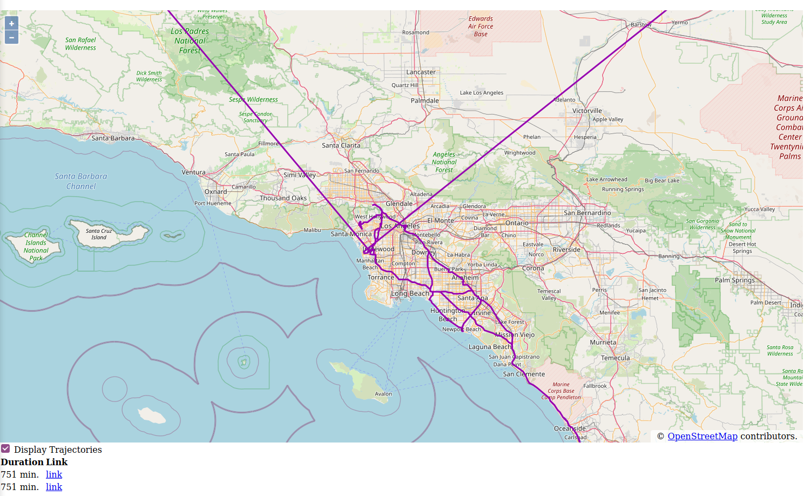

CockroachDB has gained powerful [spatial data capabilities since the 20.2 release](https://www.cockroachlabs.com/blog/how-we-built-spatial-indexing/). One of the great things about this is that the spatial features are compatible with the excellent PostGIS spatial data
extension for Postgresql (with some [caveats](https://www.cockroachlabs.com/docs/v20.2/spatial-data#compatibility)), which in my opinion is the gold standard for spatial data management.

I'm the maintainer of `Hibernate-Spatial`. An optional module which extends Hibernate with spatial capabilities. I was asked by Cockroach Labs 
to write a spatial dialect for CockroachDB. This dialect was introduced 
in [version 5.4.30.Final](https://in.relation.to/2021/03/19/hibernate-orm-5430-final-release/). 

In this blog post, I'll give you a flavor of how you can use the CockroachDB spatial dialect by building two Spring Boot 
applications. First we'll create a CLI Dataloader application to load the GPS trajectory dataset from
the [Geolife project](https://research.microsoft.com/en-us/downloads/b16d359d-d164-469e-9fd4-daa38f2b2e13/) in a
CockroachDB database. Then we'll create a REST API Trajectory service on top of this database with full CRUD functionality. 
Finally we'll add a minimal web mapping application on top of that REST service so we can dynamically view the Trajectory  
data on a map.

The full source code for this blog post is [available on GitHub](https://github.com/maesenka/hibernate-spatial-demo).

# The Dataloader

The Geolife dataset consists of about 18 000 GPS log files, each one representing a single trajectory. The Dataloader
application will read each file, extract the GPS coordinates and timestamps, and create a `Trajectory` object from the
data which is then persisted in a `trajectory` table in the database.

Our database is (of course) CockroachDB. For this demo we will use a single instance docker configuration.

```
$ docker run -d --name=cockroach -p 26257:26257 -p 8080:8080 cockroachdb/cockroach:v21.1.0 start-single-node --insecure
```

To create our application, we use the [Spring initializr](https://start.spring.io/) for maven and select the Spring Data
JPA dependency. This will bring in Hibernate as a dependency. The spatial dialects are packaged in the optional
hibernate-spatial module. So we need to add this dependency to the POM ourselves.

```
    <dependency>
      <groupId>org.hibernate</groupId>
      <artifactId>hibernate-spatial</artifactId>
    </dependency>
```

To finalize the setup of our project, we create the application.properties file. We'll let Hibernate
automatically create the required table objects for us (`spring.jpa.hibernatgge.ddl-auto=create`)

```
#It's not a web app 
spring.main.web-application-type=NONE
...
spring.jpa.hibernate.ddl-auto=create
spring.jpa.properties.hibernate.dialect=org.hibernate.spatial.dialect.cockroachdb.CockroachDB202SpatialDialect
spring.datasource.url=jdbc:postgresql://localhost:26257/defaultdb?sslmode=disable
spring.datasource.username=root
spring.datasource.password=
```

Note that we need to set the dialect explicitly. If we didn't do this, Spring Boot will choose a non-spatial dialect by
default for your database.

A `SpatialDialect` extends its base `Dialect` class by adding support for Geometry types, such as `Point`, `LineString` or
`Polygon`. This means that Hibernate will handle the persistence of values of these types automatically. The spatial
dialects also register a set of spatial functions so that you can use them in JPQL (or HQL) queries. There is more
detail in Chapter 18 of
the [Hibernate User Guide](https://docs.jboss.org/hibernate/orm/5.4/userguide/html_single/Hibernate_User_Guide.html#spatial).

In fact, Hibernate supports not one but two Geometry libraries:
the [Java Topology Suite (JTS)](https://github.com/locationtech/jts) and
[GeoLatte-Geom](https://github.com/geolatte/geolatte-geom). JTS is the oldest and most popular choice. It also sets the
gold standard for computational geometry algorithm (CGA) implementations in Java. GeoLatte-Geom is a more recent
alternative that I created in parallel with Hibernate-Spatial. I felt the need for new Geometry library that is more aligned 
with the spatial capabilities of modern databases.  

In this tutorial we'll be using GeoLatte-Geom. The code on GitHub has a branch that uses JTS for those interested.

Let's continue with the Dataloader application. To represent the trajectories, we create the following Entity class.

```java

@Entity
public class Trajectory {

	@Id
	@GeneratedValue
	private UUID id;

	private LineString<G2D> geometry;

	private LocalDateTime start;

	private Long durationInMinutes;

	public Trajectory() {
	}

	public Trajectory(LineString<G2D> lineString, LocalDateTime start, LocalDateTime stop) {
		this.geometry = lineString;
		this.start = start;
		this.durationInMinutes = Duration.between( start, stop ).toMinutes();
	}

}
```

The `Trajectory` class has a `LineString<G2D>` member variable for the trajectory geometry. This means that a trajectory
is spatially represented as a LineString (a connected series of line segments) in a two-dimensional geographic
coordinate reference system.

Next, we will create a `Repository` for Trajectory. Again, using Hibernate and Spring Boot makes this almost too easy.
The full implementation is shown below. Note that we will be storing Trajectories in batches.

```java

@Transactional
@Repository
public class TrajectoryRepository {

	@PersistenceContext
	private EntityManager entityManager;

	public TrajectoryRepository() {
	}

	@Transactional
	public void saveAll(List<Trajectory> trajectories) {
		trajectories.forEach( entityManager::persist );
		entityManager.flush();
		entityManager.clear();
	}

}
```

The Geolife dataset stores trajectories as PLT text files. The `PltParser` class reads the data and turns it into
a `Trajectory` instance.

```java
public class PltParser {
    ...

	// Returns null in case of errors
	Trajectory parse() {
		try {
			var positions = PositionSequenceBuilders.variableSized( G2D.class );
			List<LocalDateTime> times = new ArrayList<>();
			Files.readString( path )
					.lines()
					.skip( 6 ) //skip the first six lines as per documentation
					.map( this::toTimestampedCoordinate ) //here we parse the GPS log record
					.filter( Objects::nonNull ) //filter out lines we couldn't parse
					.forEach( tsco -> {
						positions.add( tsco.lon, tsco.lat );
						times.add( tsco.timestamp );
					} );
			return buildTrajectory( positions, times );
		}
		catch (IOException e) {
			LOG.warn( format( "Failure to read file %s", path ), e );
			return null;
		}
	}

	private Trajectory buildTrajectory(PositionSequenceBuilder<G2D> seqBuilder, List<LocalDateTime> times) {
		if ( times.size() < 2 ) {
			return null;
		}
		var ls = new LineString<>( seqBuilder.toPositionSequence(), WGS84 );
		var start = Collections.min( times );
		var stop = Collections.max( times );
		return new Trajectory( ls, start, stop );
	}
  
  ...
}
```

The `PltParser` reads the data lines and extracts the longitude, latitude and timestamp in to a helper
`TimeStampedCoordinate` object (not shown). The coordinates of each `TimestampedCoordinate` are then collected in
a `PositionSequenceBuilder`, and the timestamps in a `List`. The `buildTrajectory()` method turns these into
a `Trajectory` object.

Finally, we complete the Dataloader by walking over the files in the data directory, parse each file and store the
resulting `Trajectory` in the database. To make this a bit more interesting we'll use
[Reactor](https://projectreactor.io/) to parallelize both the parse and the database store operations.

The core logic of the Dataloader is the `processPaths` method. It takes as argument a stream of `Path`s and parses the
files in parallel. The results are merged to a single stream, which is then buffered in batches of 64 trajectories.
These batches are then in parallel persisted to the Cockroach database.

```java
    private Flux<?> processPaths(Flux<Path> paths){
		return paths.parallel(PARALLELISM)
		.runOn(Schedulers.parallel())
		.map(PltParser::new)
		.map(PltParser::parse)
		.filter(Objects::nonNull)
		.sequential()  //merge result
		.buffer(64)
		.parallel(PARALLELISM)
		.runOn(Schedulers.parallel())
		.doOnNext(repository::saveAll)
		.sequential();
		}
```

Let's see it in operation:

```bash
$ mvn package
$ java -jar target/dataloader-0.0.1-SNAPSHOT.jar $GEOLIFE_DATA_DIRECTORY
.   ____          _            __ _ _
 /\\ / ___'_ __ _ _(_)_ __  __ _ \ \ \ \
( ( )\___ | '_ | '_| | '_ \/ _` | \ \ \ \
 \\/  ___)| |_)| | | | | || (_| |  ) ) ) )
  '  |____| .__|_| |_|_| |_\__, | / / / /
 =========|_|==============|___/=/_/_/_/
 :: Spring Boot ::                (v2.4.5)

2021-05-24 20:07:37.163  INFO 190389 --- [           main] com.example.DataloaderApp                : Starting DataloaderApp v0.0.1-SNAPSHOT using Java 11.0.10 on threadripper1 with PID 190389 (/home/maesenka/workspaces/spins/route-analyser/dataloader/target/dataloader-0.0.1-SNAPSHOT.jar started by maesenka in /home/maesenka/workspaces/spins/route-analyser/dataloader)
2021-05-24 20:07:37.164  INFO 190389 --- [           main] com.example.DataloaderApp                : No active profile set, falling back to default profiles: default
2021-05-24 20:07:37.470  INFO 190389 --- [           main] .s.d.r.c.RepositoryConfigurationDelegate : Bootstrapping Spring Data JPA repositories in DEFAULT mode.
2021-05-24 20:07:37.477  INFO 190389 --- [           main] .s.d.r.c.RepositoryConfigurationDelegate : Finished Spring Data repository scanning in 2 ms. Found 0 JPA repository interfaces.
2021-05-24 20:07:37.790  INFO 190389 --- [           main] o.hibernate.jpa.internal.util.LogHelper  : HHH000204: Processing PersistenceUnitInfo [name: default]
2021-05-24 20:07:37.841  INFO 190389 --- [           main] org.hibernate.Version                    : HHH000412: Hibernate ORM core version 5.4.31.Final
2021-05-24 20:07:37.910  INFO 190389 --- [           main] o.h.spatial.integration.SpatialService   : HHH80000001: hibernate-spatial integration enabled : true
2021-05-24 20:07:37.929  INFO 190389 --- [           main] o.hibernate.annotations.common.Version   : HCANN000001: Hibernate Commons Annotations {5.1.2.Final}
2021-05-24 20:07:38.008  INFO 190389 --- [           main] com.zaxxer.hikari.HikariDataSource       : HikariPool-1 - Starting...
2021-05-24 20:07:38.063  INFO 190389 --- [           main] com.zaxxer.hikari.HikariDataSource       : HikariPool-1 - Start completed.
2021-05-24 20:07:38.096  INFO 190389 --- [           main] org.hibernate.dialect.Dialect            : HHH000400: Using dialect: org.hibernate.spatial.dialect.cockroachdb.CockroachDB202SpatialDialect
2021-05-24 20:07:38.509  INFO 190389 --- [           main] o.h.e.t.j.p.i.JtaPlatformInitiator       : HHH000490: Using JtaPlatform implementation: [org.hibernate.engine.transaction.jta.platform.internal.NoJtaPlatform]
2021-05-24 20:07:38.521  INFO 190389 --- [           main] j.LocalContainerEntityManagerFactoryBean : Initialized JPA EntityManagerFactory for persistence unit 'default'
2021-05-24 20:07:38.605  INFO 190389 --- [           main] com.example.DataloaderApp                : Started DataloaderApp in 1.741 seconds (JVM running for 2.067)
2021-05-24 20:07:38.608  INFO 190389 --- [           main] com.example.DataloaderApp                : Parallelism set at: 16
2021-05-24 20:07:38.608  INFO 190389 --- [           main] com.example.DataloaderApp                : Batchsize set at: 128
Parsing all files took (ms): 6453
2021-05-24 20:07:45.070  INFO 190389 --- [extShutdownHook] j.LocalContainerEntityManagerFactoryBean : Closing JPA EntityManagerFactory for persistence unit 'default'
2021-05-24 20:07:45.073  INFO 190389 --- [extShutdownHook] com.zaxxer.hikari.HikariDataSource       : HikariPool-1 - Shutdown initiated...
2021-05-24 20:07:45.077  INFO 190389 --- [extShutdownHook] com.zaxxer.hikari.HikariDataSource       : HikariPool-1 - Shutdown completed.
```

Let's inspect the result:

```
$ psql -U root -h localhost -p 26257 -d defaultdb

defaultdb=# select count(*) from trajectory;
 count
-------
 18670
(1 row)

```

We've read 18760 data files, parsed them and stored them in a database in less than 7 seconds making full use of the
available cores (admittedly on a rather beefy machine).

Using Hibernate makes it possible to create applications that are portable across databases (within limits, of course). 

For example, if you change the application.properties as show below, we can now target a postgresql database without any code changes.

```
spring.jpa.properties.hibernate.dialect=org.hibernate.spatial.dialect.postgis.PostgisPG95Dialect
spring.datasource.url=jdbc:postgresql://localhost/hibernate_orm_test
```
In fact, the code as written will work on any database for which a SpatialDialect exists.

# A spatial REST API

Now that we have trajectory data in our database, let's create a REST application on top of this
using [Spring Data REST](https://spring.io/projects/spring-data-rest).

Again using Spring Initializr we can create a maven project as a starting point. We now select "Spring Data JPA"
and "Rest Repositories" as dependencies. Again we need to add `hibernate-spatial` as a depenceny. We will also add the
`geolatte-geojson` library as a dependency for serializing Geometries to [GeoJson](https://geojson.org/).

```         
		<dependency>
			<groupId>org.hibernate</groupId>
			<artifactId>hibernate-spatial</artifactId>
		</dependency>
		<dependency>
			<groupId>org.geolatte</groupId>
			<artifactId>geolatte-geojson</artifactId>
			<version>1.8.0</version>
		</dependency>

```

The `Trajectory` entity class is the same as above, except we also add getters for the member variables.

To create a basic Json REST service supporting creating, updating and retrieving trajectories, we only need to create
a `Repository`, and make sure the Jackson can (de)serialize `Trajectory` entities.

The Json serialization can be handled by a custom Json builder

```java

@Configuration
public class JsonBuilderConfig {
	@Bean
	public Jackson2ObjectMapperBuilder jackson2ObjectMapperBuilder() {
		var module = new GeolatteGeomModule( WGS84 );
		return new Jackson2ObjectMapperBuilder()
				.modules( module )
				.serializers( new LocalDateTimeSerializer( DateTimeFormatter.ISO_LOCAL_DATE_TIME ) )
				.deserializers( new LocalDateTimeDeserializer( DateTimeFormatter.ISO_LOCAL_DATE_TIME ) );
	}
}
```

This adds the `GeolatteGeomModule` which will take care of serializing the Trajectory geometries to GeoJSON. We also
configure Jackson to properly write the Trajectory start timestamps as ISO formatted Strings.

As for the repository, we only need to declare our Repository interface as a `PagingAndSortingRepository` and Spring
Data REST will generate the data access logic, and the REST controllers automatically.

```java

public interface TrajectoryRepository extends PagingAndSortingRepository<Trajectory, UUID> {

}
```

Let's start up the application and use [HTTPie](https://httpie.io/) to test the REST API on the command-line. As GeoJson
is (very) verbose, we'll use [jq](https://stedolan.github.io/jq/) to transformt the GeoJson to something more concise.

```bash
$ http GET http://localhost:9000/api/trajectories page==5 \
  | jq '._embedded.trajectories[] | {duration: .durationInMinutes, url: ._links.self.href}'
{
  "duration": 140,
  "url": "http://localhost:9000/api/trajectories/00038521-5b54-4659-8889-537d79f9b5f3"
}
{
  "duration": 42,
  "url": "http://localhost:9000/api/trajectories/0004c17b-e9f1-482c-aadc-32398657a5b3"
}
{
  "duration": 25,
  "url": "http://localhost:9000/api/trajectories/0005b24c-c709-4923-8533-1182d0916e3b"
}
{
  "duration": 5,
  "url": "http://localhost:9000/api/trajectories/00073325-0c68-4024-9d39-91b7fa632fcb"
}
{
  "duration": 69,
  "url": "http://localhost:9000/api/trajectories/000acdd6-3364-420b-a1b3-2b93076bcb4e"
}
```

The JQ expression we used iterates over each Trajectory JSON object, and maps it to an object with only the duration,
and the link

Now let's inspect the shortest trajectory.

```
$ http GET http://localhost:9000/api/trajectories/00073325-0c68-4024-9d39-91b7fa632fcb
{
  "geometry" : {
    "type" : "LineString",
    "crs" : {
      "type" : "name",
      "properties" : {
        "name" : "EPSG:4326"
      }
    },
    "coordinates" : [ [ 116.340436, 39.981813 ], [ 116.340697, 39.982132 ], ...]
  },
  "start" : "2008-12-02T15:17:06",
  "durationInMinutes" : 5,
  "_links" : {
    "self" : {
      "href" : "http://localhost:9000/api/trajectories/00073325-0c68-4024-9d39-91b7fa632fcb"
    },
    "trajectory" : {
      "href" : "http://localhost:9000/api/trajectories/00073325-0c68-4024-9d39-91b7fa632fcb"
    }
  }
}
```

Spring Data REST also adds support for PUT and POST to update, resp. create Trajectory instances. To demonstrate that
this works, let's change the duration attribute to 6 minutes for the trajectory we just retrieved.

```
$  http GET http://localhost:9000/api/trajectories/00073325-0c68-4024-9d39-91b7fa632fcb \
   | sed -e 's/"durationInMinutes" : 5/"durationInMinutes" : 6/' \
   | http PUT http://localhost:9000/api/trajectories/00073325-0c68-4024-9d39-91b7fa632fcb
{
  "geometry" : {
    "type" : "LineString",    
      .....
}
  
$ http GET http://localhost:9000/api/trajectories/00073325-0c68-4024-9d39-91b7fa632fcb | jq .durationInMinutes
6     
```

# A dynamic Trajectories map

It would be nice to actually see the trajectories on a map. So let's create a simple web map using the
[OpenLayers](https://openlayers.org/) JavaScript framework. The result will look like this



The details of how the front-end is set up is beyond the scope of this tutorial. The source code for the web map is in
the `/web/js/main.js` file and is sufficiently documented to understand what's happening.

The most relevant JavaScript is shown below. The `trajectorySource` object is responsible for loading the trajectory
data in the map every time that the map extent changes (that is what `strategy: bbox` means). It uses the `loader`
function to fetch the trajectory data from the REST service. OpenLayers provides a `GeoJSON` class that we use to
deserialize the GeoJson objects. The GeoJson object also projects the data from WGS84 (the CRS for the data returned by
the REST service) to WEB_MERCATOR (identified by `EPSG:3857`) that is needed to display the geometry on the map.

```javascript

const format = new GeoJSON( {dataProjection: 'EPSG:4326', featureProjection: 'EPSG:3857'} );

const trajectorySource = new VectorSource(
    {
        loader: function (extent, resolution, projection) {
            if ( !isTrajectoriesActive || extent[0] === -Infinity ) {
                return;
            }
            let url = buildFetchUrl( extent );
            dataFetch( url );
        },
        strategy: bbox
    } );

const buildFetchUrl = function (extent) {
    let ll = olProj.toLonLat( [extent[0], extent[1]] );
    let ur = olProj.toLonLat( [extent[2], extent[3]] );
    let bbox = `${ll[0]},${ll[1]},${ur[0]},${ur[1]}`;
    return `/api/trajectories/search/bbox?bbox=${bbox}`;
};

/**
 * Fetch data using specified URL and load into the VectorSource
 * @param url
 */
const dataFetch = function (url) {
    console.log( "Fetching URL:", url )
    fetch( url )
        .then( response => {
            if ( response.ok ) {
                return response.json();
            }
        ...
        } )
        .then( data => {
                   let trajectoryData = data['_embedded']['trajectories'];
                   let features = trajectoryData.map(
                       tr => {
                           let f = new Feature( {
                                                    geometry: format.readGeometry( tr['geometry'] ),
                                                    start: tr['start'],
                                                    duration: tr['durationInMinutes']
                                                } );
                           f.setId( tr['_links']['self']['href'] );
                           return f;
                       }
                   );
                   trajectorySource.addFeatures( features );
               }
        );
};

```

As you may have deduced from the code, the client assumes a `api/trajectories/search/bbox?bbox=<extent>` resource that accepts the
map extent as a parameter. How can we implement this in the backend?

First, we need to extend our `TrajectoryRepository` with the specialised `bbox()` custom search method. To this end we
create the following interface

```java

@Component
public interface TrajectoryCustomRepository {

	/**
	 * Find all {@code Trajectory}s that overlap with the specified bounding box
	 * @param bbox the bounding box as a String (minlon, minlat, maxlon, maxlat)
	 * @return the {@code Trajectory}s that overlap with the specified bounding box
	 */
	@RestResource(path = "bbox")
	List<Trajectory> bbox(String bbox);

}
```

We must also have the `TrajectoryRepository` extend this interface.

```java
public interface TrajectoryRepository extends
		PagingAndSortingRepository<Trajectory, UUID>,
		TrajectoryCustomRepository {
}
```

Since we're using a Spatial Dialect, we can use JPQL to implement the `bbox()` method.

```java
public class TrajectoryCustomRepositoryImpl implements TrajectoryCustomRepository {

	...

	@Override
	public List<Trajectory> bbox(String bbox) {
		TypedQuery<Trajectory> query = entityManager.createQuery(
				"select t from Trajectory  t where filter(t.geometry, :param) = true ",
				Trajectory.class
		);
		Polygon<G2D> filter = fromBbox( bbox ); //String to Polygon
		query.setParameter( "param", filter );
		return query.getResultList();
	}
	...
}
``` 

The `filter()` function in the JPQL query is provided by the CockroachDB spatial dialect. Hibernate will translate this
approximately to the following SQL query that uses the `&&` spatial operator.

```sql
select t.*
from trajectory t
where (t.geometry && ?) = true
```

And that is all we have to do. We now have a REST service for trajectories that offers CRUD functionality, plus bounding
box searches to power a dynamic map front-end.

Now if we run this the first time, we get If we run this the first time, we get this error.

```
org.postgresql.util.PSQLException: ERROR: this box2d comparison operator is experimental
  Hint: To enable box2d comparators, use `SET CLUSTER SETTING sql.spatial.experimental_box2d_comparison_operators.enabled = on`.
```

So we do as we are told.

```bash
docker exec -it cockroach bash -c "cat <<EOF | ./cockroach sql --insecure
SET CLUSTER SETTING sql.spatial.experimental_box2d_comparison_operators.enabled = on;
quit
EOF
"
```

Beware, there are serious limitations to this implementation. First there are no limits set on the result size. As it
happens, most of the trajectories were registered in and around Beijing. So if you set the map extent to Beijing, then
most of the dataset will get serialized to Json and sent to your browser. This might crash your browser, if the REST
service process doesn't throw an OutOfMemoryError first.

There are ways around this depending on your use case. You might set an arbitrary limit of the features to send, or use
the zoom-level to choose what to send to the browser. Another important strategy to deal with this issue is to make the
REST service reactive. In this way the features will be streamed to the client as they become available from the
database. How to do this with Hibenate and Spring Boot is the subject for another tutorial.
